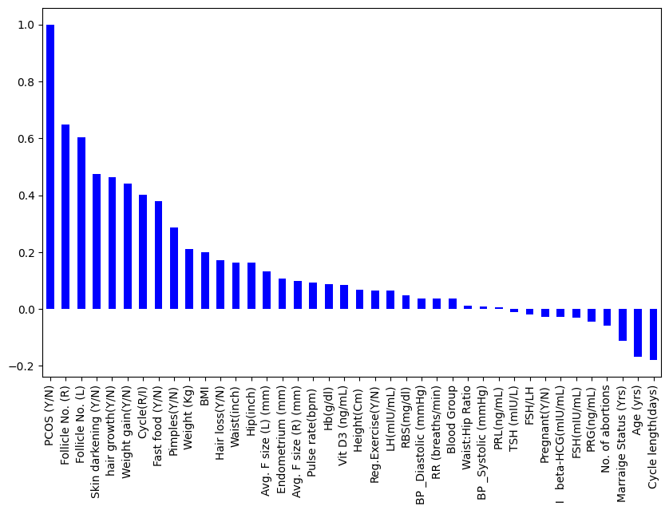

# Predictor of PCOS
Exploring PCOS dataset to determine if there are predictor markers using the 'pcos-dataset' downloaded from [Kaggle](https://www.kaggle.com/datasets/shreyasvedpathak/pcos-dataset/). Data exploration done in Google's Colab/Jupyter notebook.

